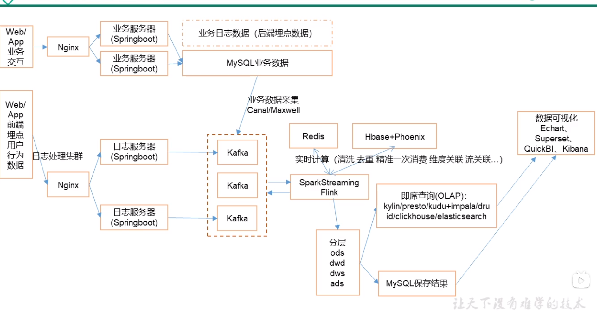

# 注

## SQOOP

*Sqoop*(发音：skup)是一款开源的工具，主要用于在Hadoop(Hive)与传统的数据库(mysql、postgresql...)间进行数据的传递，可以将一个关系型数据库（例如 ： MySQL ,Oracle ,Postgres等）中的数据导进到Hadoop的HDFS中

## OLTP与OLAP

业务类系统主要供基层人员使用，进行一线业务操作，通常被称为OLTP（On-Line Transaction Processing，联机事务处理）。

数据分析的目标则是探索并挖掘数据价值，作为企业高层进行决策的参考，通常被称为OLAP（On-Line Analytical Processing，联机分析处理）。

主要技术 kylin/kudu + impala、clickhouse、elasticsearch(分析存储)

## 数仓分层

## 宽表

数据库字段比较多的表，方便查询与实时数仓进行数据分析使用

