## 客观题
### 1. 在面向对象中，实现信息隐蔽是依靠什么？
对象的封装
### 2. 将描述事物的数据与对数据的操作封装在一起
### 3. 继承机制为编程人员提供了程序复用的途径
### 4. 面向对象优点不包括以数据为中心
### 5. 面向对象，对象之间通过消息传递
## 主观题
怎么理解面向对象设计中的封装?
在面向对象编程方法中，封装（英语：Encapsulation）是指，一种将抽象性函数接口的实现细节部分包装、隐藏起来的方法。同时，它也是一种防止外界调用端，去访问对象内部实现细节的手段，这个手段是由编程语言本身来提供的。封装被视为是面向对象的四项原则之一。
适当的封装，可以将对象使用接口的程序实现部分隐藏起来，不让用户看到，同时确保用户无法任意更改对象内部的重要资料，若想接触资料只能通过公开接入方法（Publicly accessible methods）的方式（ 如："getters" 和"setters"）。它可以让代码更容易理解与维护，也加强了代码的安全性。
怎么理解面向对象中的继承？
继承（英语：inheritance）是面向对象软件技术当中的一个概念。
如果一个类别B“继承自”另一个类别A，就把这个B称为“A的子类”，而把A称为“B的父类别”也可以称“A是B的超类”。
继承可以使得子类具有父类别的各种属性和方法，而不需要再次编写相同的代码。在令子类别继承父类别的同时，可以重新定义某些属性，并重写某些方法，即覆盖父类别的原有属性和方法，使其获得与父类别不同的功能。另外，为子类追加新的属性和方法也是常见的做法。 一般静态的面向对象编程语言，继承属于静态的，意即在子类的行为在编译期就已经决定，无法在运行期扩展。
对象与对象之间有哪几种关系？
引用 继承
一、继承关系继承指的是一个类（称为子类、子接口）继承另外的一个类（称为父类、父接口）的功能，并可以增加它自己的新功能的能力。在Java中继承关系通过关键字extends明确标识，在设计时一般没有争议性。在UML类图设计中，继承用一条带空心三角箭头的实线表示，从子类指向父类，或者子接口指向父接口。
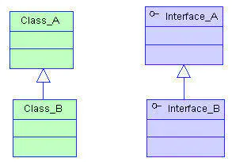
二、实现关系实现指的是一个class类实现interface接口（可以是多个）的功能，实现是类与接口之间最常见的关系。在Java中此类关系通过关键字implements明确标识，在设计时一般没有争议性。在UML类图设计中，实现用一条带空心三角箭头的虚线表示，从类指向实现的接口。
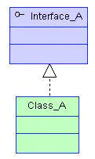
三、依赖关系简单的理解，依赖就是一个类A使用到了另一个类B，而这种使用关系是具有偶然性的、临时性的、非常弱的，但是类B的变化会影响到类A。比如某人要过河，需要借用一条船，此时人与船之间的关系就是依赖。表现在代码层面，为类B作为参数被类A在某个method方法中使用。在UML类图设计中，依赖关系用由类A指向类B的带箭头虚线表示。
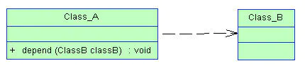
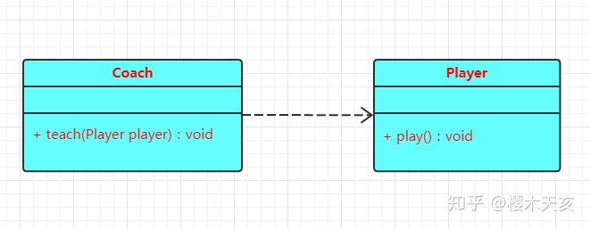
依赖关系通常指的是一种单向的关系，指的是调用关系。具体到代码中往往表现为一个类的方法里面的参数是另一个类的某个具体的对象。换句话说，如果 A 依赖于 B，那么代码中 B 表现为 A 的方法参数、局部变量或静态方法调用等。比如，一支球队中的教练和球员的关系，教练可以教球员练习球技，教这个动作是教练这个类中的一个方法，那么教哪个球员呢？这里某个球员是球员这个类中的某个具体的对象，在这里作为教练这个类中的教（）这个方法的参数出现。

依赖关系在 UML 中用虚线 + 箭头来表示。如下图，表示 Coach 和 Player 这两个类是依赖关系，其中，Coach 依赖于 Player。
```java
public class Coach {
    public void teach(Player player) {
        player.play();
    }
}

class Player {
    public void play() {
        System.out.println("打球最重要的就是动作要快，姿势要帅！");
        System.out.println("教练怎么教我就怎么打！");
        System.out.println("重要的是要风靡万千少女和老太太！");
    }
}
```

四、(persn card1...n)关联关系关联体现的是两个类之间语义级别的一种强依赖关系，比如我和我的朋友，这种关系比依赖更强、不存在依赖关系的偶然性、关系也不是临时性的，一般是长期性的，而且双方的关系一般是平等的。关联可以是单向、双向的。表现在代码层面，为被关联类B以类的属性形式出现在关联类A中，也可能是关联类A引用了一个类型为被关联类B的全局变量。在UML类图设计中，关联关系用由关联类A指向被关联类B的带箭头实线表示，在关联的两端可以标注关联双方的角色和多重性标记。
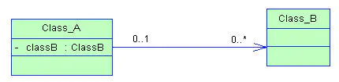
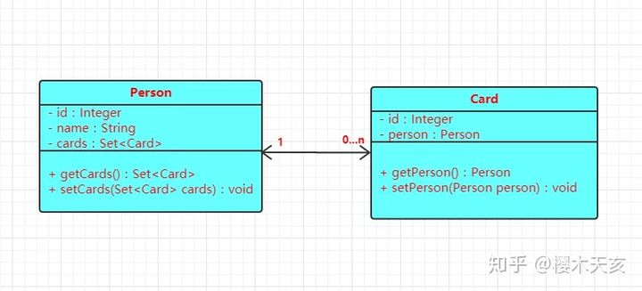
关联关系是一种比较弱的关系，指两个类之间存在某种对应关系。比如个人和银行卡，一个人是可以拥有多张银行卡的，但是一张银行卡只可能属于某一个人，不可能说一张银行卡既属于你，也属于我，这是根据身份证来办的，很显然是唯一的。

根据方向可以分为单向的和双向的，根据对应的数量可以分为一对一、一对多、多对一和多对多等几种关系。比如，下图中的 Person—>Card 是双向一对多关系，反过来Card—> Person 则是双向多对一关系。关联关系在 UML 中用实线 + 箭头来表示。

```java
class Person {
  private Integer id;
  private String name;
  private Set<Card> cards;

  public Set<Card> getCards() {
    return cards;
  }

  public void setCards(Set<Card> cards) {
    this.cards = cards;
  }
}

class Card {
  private Integer id;
  private Person person;

  public Person getPerson() {
    return person;
  }

  public void setPerson(Person person) {
    this.person = person;
  }
}

```
五、聚合关系聚合是关联关系的一种特例，它体现的是整体与部分的关系，即has-a的关系。此时整体与部分之间是可分离的，它们可以具有各自的生命周期，部分可以属于多个整体对象，也可以为多个整体对象共享。比如计算机与CPU、公司与员工的关系等，比如一个航母编队包括海空母舰、驱护舰艇、舰载飞机及核动力攻击潜艇等。表现在代码层面，和关联关系是一致的，只能从语义级别来区分。在UML类图设计中，聚合关系以空心菱形加实线箭头表示。
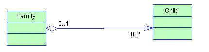
聚合关系和组合关系其实是更切合整体—>部分关系的，通常我们更喜欢将关联关系和依赖关系形容为 use a 的关系，而聚合关系和组合关系则形容为 has a的关系。

那么，到底什么是聚合关系呢？聚合关系更加强调整体和部分的关系，通常，我们会说 xx 是 xx 的一部分，只要说得通，那么他们之间就是聚合关系。比如，主板是电脑的一部分，显卡是电脑的一部分，电池是电脑的一部分，很显然这都是说得通的。

但是，有一点需要注意的是，聚合关系中的部分是相互独立的，并不是说部分离开了整体不能独立存在。比如，一块显卡、主板或电池既可以装在电脑 A 中，同样也可以装在电脑 B 中，并不是固定在某台电脑上面，就像这里 A 中的主板离开了 A 装在 B 中仍然是有意义的。

聚合关系表示成 UML 中的类图时，他们之间的关系使用空心菱形+实线表示，具体如下：

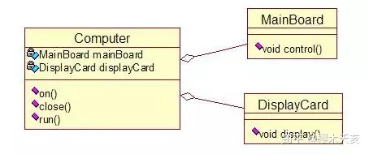

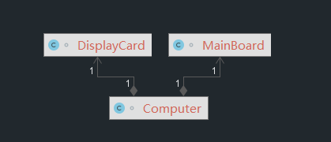


六、组合关系组合也是关联关系的一种特例，它体现的是一种contains-a的关系，这种关系比聚合更强，也称为强聚合。它同样体现整体与部分间的关系，但此时整体与部分是不可分的，整体的生命周期结束也就意味着部分的生命周期结束，比如人和人的大脑。表现在代码层面，和关联关系是一致的，只能从语义级别来区分。在UML类图设计中，组合关系以实心菱形加实线箭头表示。
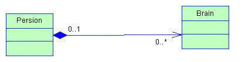

前面说了聚合关系，那组合关系又是什么呢？组合关系与聚合关系其实大同小异，打最大的不同在于，组合关系中的整体和部分密不可分，不像聚合关系中部分离开了整体还是有意义的。组合关系则不同，比如人体是由头、手、脚等组成的，一个人的脑袋不可能说既属于自己又属于别人，手和脚也是一样的道理。你的头和手、脚等离开了你的身体也没有什么存在的意义。

那么，组合关系在 UML 的类图中是如何表示的呢？组合使用实心菱形和实线表示。比如下图中表示 People 是由 Head、Hand、Leg等组成。

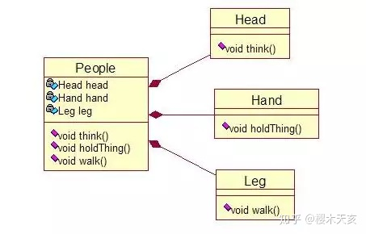
